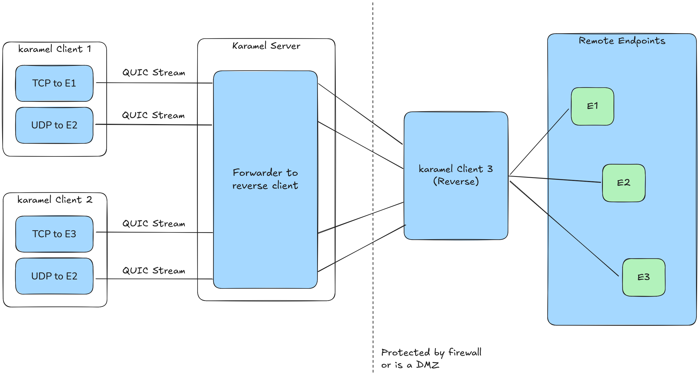

# karamel

Decently fast TCP/UDP tunnel over QUIC using SOCKS5. It is mainly used to pass through firewalls and NATs and expose a reverse tunnel even behind firewalls.

Imagine chisel, but UDP actually works over SOCKS5 and written in QUIC instead of HTTPS.



## What

- The server accepts authenticated QUIC connections.
- The client can run as a SOCKS5 proxy or in reverse mode.
- In reverse mode, the client connects back to the server and forwards traffic through that tunnel, becoming the "exit node" of the SOCKS5 proxy.

## Build

```bash
go build ./cmd/server
go build ./cmd/client
```

## Run the server

```bash
./server -quic :4433 -username karamel -password karamel
```

## Run the client in reverse mode

```bash
./client -server localhost:4433 -reverse -username karamel -password karamel
```

This makes the client connect back to the server and act as the reverse endpoint.

In other words, this is the "exit node".

## Run the client

```bash
./client -server localhost:4433 -socks :1080 -username karamel -password karamel
```

This starts a SOCKS5 listener on port 1080. All traffic will be routed through the exit node.


